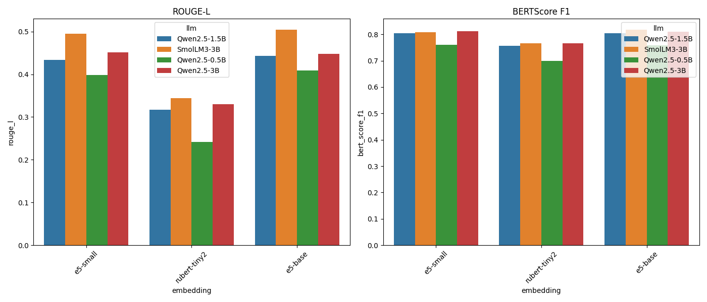
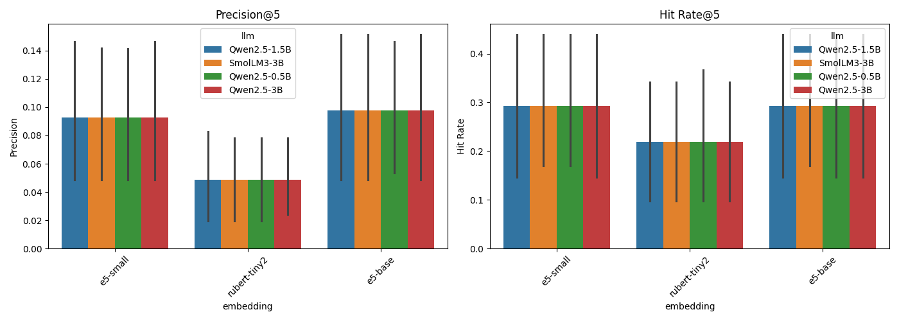
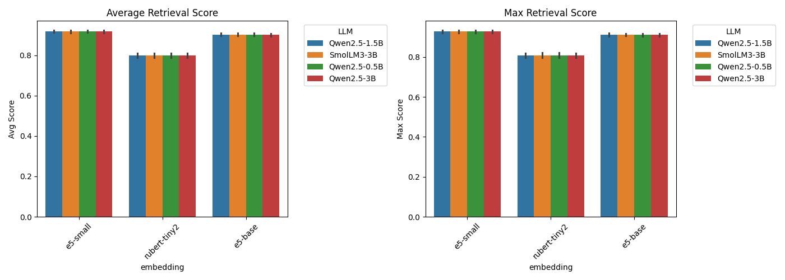

# RAG

Этот проект представляет собой Retrieval-Augmented Generation (RAG) систему, предназначенную для ответов на вопросы по технической документации с использованием LLM.

## Особенности

- **RAG-архитектура** на базе LangGraph для структурированной обработки запросов
- **Генерация ответов (LLM)** с использованием легковесных моделей (например, Qwen2.5, SmolLM3)
- **Поиск по документации (Retrieval)** через индекс FAISS и модели эмбеддингов (например, multilingual-e5)
- **Загрузка и обработка PDF** — извлечение текста из технической документации
- **Разбиение текста (Chunking)** — подготовка документов к индексации
- **REST API** на FastAPI для взаимодействия с системой
- **Бенчмаркинг** — количественная оценка качества различных комбинаций моделей

## Результаты бенчмаркинга

В ходе бенчмаркинга были протестированы 12 комбинаций генеративных моделей (LLM) и моделей эмбеддингов на наборе из 41 вопроса по технической документации ViPNet Coordinator HW (data/sample.json). Ниже приведена таблица с ключевыми результатами и рекомендациями по выбору конфигурации.

| Модель LLM (Генерация) | Модель эмбеддингов (Поиск) | BERTScore F1 (Generation) | ROUGE-L (Generation) | Precision@5 (Retrieval) | Hit Rate@5 (Retrieval) | Вывод |
| :--- | :--- | :--- | :--- | :--- | :--- | :--- |
| `SmolLM3-3B` | `multilingual-e5-base` | **0.818** | **0.505** | 0.098 | 0.293 | **Лучшее качество** (при достатке ресурсов) |
| `SmolLM3-3B` | `multilingual-e5-small` | 0.809 | 0.495 | 0.093 | 0.293 | Высокое качество, чуть хуже `e5-base` |
| `Qwen2.5-3B` | `multilingual-e5-base` | 0.810 | 0.448 | 0.098 | 0.293 | Высокое качество, сопоставимо с `SmolLM3-3B` |
| `Qwen2.5-1.5B` | `multilingual-e5-small` | 0.805 | 0.434 | 0.093 | 0.293 | **Оптимальный баланс** качества и ресурсов |
| `Qwen2.5-0.5B` | `multilingual-e5-small` | 0.761 | 0.408 | 0.093 | 0.293 | Компромисс качества для ограниченных ресурсов |
| `SmolLM3-3B` | `rubert-tiny2` | 0.766 | 0.345 | 0.049 | 0.219 | Низкое качество из-за слабой модели поиска |
| `Qwen2.5-1.5B` | `rubert-tiny2` | 0.758 | 0.444 | 0.049 | 0.219 | Низкое качество из-за слабой модели поиска |

\
*Рисунок 1 - Сравнение метрик генерации (ROUGE-L и BERTScore F1)*

\
*Рисунок 2 - Метрики качества извлечения (Precision@5 и Hit Rate@5)*

\
*Рисунок 3 - Статистика оценок сходства (среднее и максимальное значение score) для извлечённых чанков*

**Выводы:**

*   **Модель эмбеддингов критична**: `intfloat/multilingual-e5-*` значительно превосходит `cointegrated/rubert-tiny2` по метрикам извлечения, что напрямую влияет на качество генерации.
*   **Размер LLM влияет**: В пределах одного семейства (например, Qwen2.5), увеличение числа параметров (0.5B -> 1.5B -> 3B) улучшает метрики генерации.
*   **Лучшие комбинации**:
    *   **Максимальное качество**: `SmolLM3-3B` + `multilingual-e5-base`.
    *   **Баланс**: `Qwen2.5-1.5B` + `multilingual-e5-small`.
*   **Рекомендации**: Для максимальной эффективности не рекомендуется использовать `rubert-tiny2` в качестве эмбеддинговой модели для технической документации в этой задаче.

## Структура проекта

```
.
├── README.md
├── example.env               # Пример файла с переменными окружения                    
├── app.py                    # Основной скрипт FastAPI для запуска веб-сервера
├── data                      
│   ├── docs                  # Папка для входных PDF-документов (указана в DOCS_DIR)
│   │   └── ...
│   ├── experiment_results    # Папка с результатами экспериментов/бенчмарков 
│   │   └── ...
│   └── sample.json           # Выборка для бенчмарка
├── notebooks                 
│   └── benchmark.ipynb       # Ноутбук для бенчмаркинга
├── requirements.txt          
├── scripts                   
│   └── build_index.py        # Скрипт для построения индекса FAISS
└── src                       
    ├── __init__.py           
    ├── chunking.py           # Логика разбиения текста на чанки
    ├── config.py             # Класс конфигурации, загрузка .env
    ├── data_loader.py        # Логика загрузки данных из PDF
    ├── embeddings.py         # Логика работы с эмбеддингами и индексом FAISS
    ├── generator.py          # Логика генерации ответов с помощью LLM
    ├── graph.py              # Определение графа обработки RAG (langgraph)
    ├── retriever.py          # Логика поиска релевантных чанков
    └── utils.py              # Вспомогательные функции (логирование, форматирование)
```

## Установка и настройка

1.  **Клонирование репозитория:**
    ```bash
    git clone github.com/innokeny/rag.git
    cd rag
    ```

2.  **Создание виртуального окружения (рекомендуется):**
    ```bash
    python -m venv .venv
    source .venv/bin/activate  # On Windows: .venv\Scripts\activate
    ```

3.  **Установка зависимостей:**
    Убедитесь, что у вас установлены `torch`, `torchvision`, `torchaudio` с поддержкой CUDA (см. официальную документацию PyTorch для получения команды установки под вашу систему и версию CUDA, например, `pip install torch torchvision torchaudio --index-url https://download.pytorch.org/whl/cu128`).
    Затем установите остальные зависимости:
    ```bash
    pip install -r requirements.txt
    ```

4.  **Настройка переменных окружения:**
    Создайте файл `.env` в корне проекта и укажите необходимые переменные, как в предоставленном примере `example.env`.

5.  **Подготовка документов:**
    Поместите PDF-файлы с документацией (например, [Документация ViPNet Coordinator HW 5](https://infotecs.ru/downloads/documents/vipnet-coordinator-hw-5/)) в директорию, указанную в переменной `DOCS_DIR` (по умолчанию `data/docs`).

6.  **Построение индекса:**
    Выполните скрипт `scripts/build_index.py`. Он загрузит документы, создаст чанки, сгенерирует эмбеддинги и построит индекс FAISS, сохранив его в директорию,INDEX_DIR` (по умолчанию `data/index`).
    ```bash
    python scripts/build_index.py
    ```

## Запуск приложения

После успешного построения индекса запустите веб-сервер API:

```bash
python app.py
```

Приложение будет доступно по адресу `http://localhost:8000`. Интерфейс Swagger UI для тестирования API будет доступен по адресу `http://localhost:8000/docs`.

## Использование API

*   **POST `/ask`**: Отправьте POST-запрос с JSON-телом `{"question": "Ваш вопрос здесь"}`.
*   **GET `/health`**: Проверьте статус приложения.